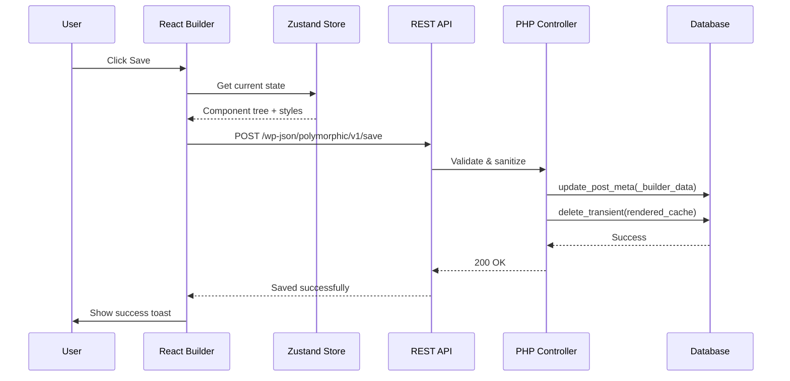
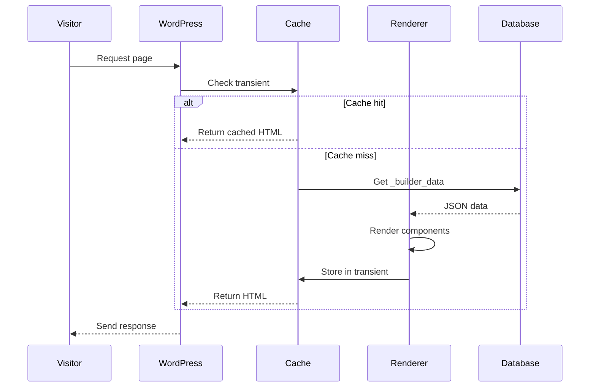

# Architecture & Technical Design

## System Overview

```mermaid
graph TB
    subgraph WordPress["WordPress Core"]
        WP[WordPress]
        PM[Post Meta]
        TR[Transients]
        REST[REST API]
    end
    
    subgraph Plugin["Polymorphic Plugin"]
        subgraph Admin["Admin Builder"]
            REACT[React App]
            DND[Dnd-kit]
            ZS[Zustand Store]
        end
        
        subgraph Core["PHP Core"]
            LOADER[Plugin Loader]
            COMP[Component Registry]
            RENDER[Renderer]
            CACHE[Cache Manager]
        end
    end
    
    subgraph Frontend["Frontend"]
        HTML[Rendered HTML]
        CSS[Component CSS]
        JS[Minimal JS]
    end
    
    REACT --> |Save| REST
    REST --> |Store JSON| PM
    PM --> |Load| RENDER
    RENDER --> |Cache| TR
    TR --> |Serve| HTML
    COMP --> RENDER
</mermaid>
```

---

## Tech Stack

### Admin Builder (JavaScript)

| Layer | Technology | Rationale |
|-------|------------|-----------|
| Framework | **React 18+** | WordPress ecosystem standard, better developer pool |
| Build Tool | **@wordpress/scripts** | Native WP integration, no extra config needed |
| Drag & Drop | **dnd-kit** | Modern, accessible, performant, tree-shakeable |
| State Management | **Zustand** | Minimal boilerplate, excellent DevTools, small bundle |
| Styling | **CSS Modules** | Scoped styles, no runtime cost, works with WP build |
| Icons | **Lucide React** | Tree-shakeable, clean design, MIT licensed |
| Type Safety | **TypeScript** | Better DX, catch errors early, self-documenting |

### Backend (PHP)

| Layer | Technology | Rationale |
|-------|------------|-----------|
| Minimum PHP | **8.0+** | Modern features, better performance |
| Minimum WP | **6.0+** | Block editor compatibility, modern APIs |
| Coding Standard | **WordPress CS** | Consistency, community familiarity |
| Autoloading | **Composer PSR-4** | Modern PHP practices |

---

## Plugin Architecture

### Directory Structure

```
polymorphic/
├── .agent/
│   └── workflows/
│       ├── development.md      # Development workflow
│       └── testing.md          # Testing workflow
│
├── docs/                       # Documentation
│   ├── 00-project-overview.md
│   ├── 01-architecture.md
│   └── ...
│
├── assets/                     # Compiled assets (git-ignored, built)
│   ├── admin/
│   │   ├── builder.js
│   │   ├── builder.css
│   │   └── builder.asset.php
│   └── frontend/
│       ├── components.js
│       └── components.css
│
├── includes/                   # PHP source files
│   ├── Admin/
│   │   ├── class-admin-menu.php
│   │   ├── class-builder-page.php
│   │   └── class-assets.php
│   │
│   ├── Api/
│   │   ├── class-rest-controller.php
│   │   ├── class-save-endpoint.php
│   │   └── class-load-endpoint.php
│   │
│   ├── Components/
│   │   ├── class-component-registry.php
│   │   ├── class-component-base.php
│   │   ├── Heading/
│   │   │   └── class-heading.php
│   │   ├── Text/
│   │   │   └── class-text.php
│   │   ├── Image/
│   │   │   └── class-image.php
│   │   ├── Button/
│   │   │   └── class-button.php
│   │   ├── Section/
│   │   │   └── class-section.php
│   │   └── Container/
│   │       └── class-container.php
│   │
│   ├── Core/
│   │   ├── class-plugin.php
│   │   ├── class-activator.php
│   │   ├── class-deactivator.php
│   │   └── class-i18n.php
│   │
│   ├── Frontend/
│   │   ├── class-renderer.php
│   │   ├── class-styles.php
│   │   └── class-scripts.php
│   │
│   ├── Cache/
│   │   └── class-transient-cache.php
│   │
│   └── Helpers/
│       ├── class-sanitizer.php
│       ├── class-validator.php
│       └── class-utils.php
│
├── languages/                  # Translation files
│   └── polymorphic.pot
│
├── src/                        # React source files
│   ├── components/
│   │   ├── builder/
│   │   │   ├── Canvas.tsx
│   │   │   ├── Sidebar.tsx
│   │   │   ├── Toolbar.tsx
│   │   │   └── PropertyPanel.tsx
│   │   │
│   │   ├── elements/
│   │   │   ├── HeadingElement.tsx
│   │   │   ├── TextElement.tsx
│   │   │   ├── ImageElement.tsx
│   │   │   ├── ButtonElement.tsx
│   │   │   ├── SectionElement.tsx
│   │   │   └── ContainerElement.tsx
│   │   │
│   │   ├── controls/
│   │   │   ├── TextControl.tsx
│   │   │   ├── ColorControl.tsx
│   │   │   ├── SpacingControl.tsx
│   │   │   ├── TypographyControl.tsx
│   │   │   └── LinkControl.tsx
│   │   │
│   │   └── ui/
│   │       ├── Button.tsx
│   │       ├── Input.tsx
│   │       ├── Select.tsx
│   │       └── Panel.tsx
│   │
│   ├── hooks/
│   │   ├── useBuilder.ts
│   │   ├── useHistory.ts
│   │   ├── useSelection.ts
│   │   └── useDragDrop.ts
│   │
│   ├── store/
│   │   ├── builderStore.ts
│   │   ├── historyStore.ts
│   │   └── uiStore.ts
│   │
│   ├── types/
│   │   ├── components.ts
│   │   ├── builder.ts
│   │   └── api.ts
│   │
│   ├── utils/
│   │   ├── api.ts
│   │   ├── componentFactory.ts
│   │   └── validators.ts
│   │
│   ├── styles/
│   │   ├── variables.css
│   │   ├── builder.module.css
│   │   └── components.module.css
│   │
│   └── index.tsx              # Entry point
│
├── templates/                  # PHP templates
│   └── builder-page.php
│
├── tests/
│   ├── php/
│   │   └── ...
│   └── js/
│       └── ...
│
├── vendor/                     # Composer dependencies (git-ignored)
│
├── node_modules/               # NPM dependencies (git-ignored)
│
├── .eslintrc.js
├── .prettierrc
├── .phpcs.xml
├── composer.json
├── package.json
├── tsconfig.json
├── webpack.config.js          # Extends @wordpress/scripts
├── polymorphic.php            # Main plugin file
├── uninstall.php
└── README.md
```

---

## Data Flow

### Save Operation



### Render Operation



---

## Component Lifecycle

### Builder (React)

1. **Registration**: Component types registered in factory
2. **Instantiation**: User drags component to canvas
3. **Configuration**: User edits properties in panel
4. **Serialization**: State saved as JSON
5. **Persistence**: Sent to REST API on save

### Frontend (PHP)

1. **Loading**: JSON retrieved from postmeta
2. **Parsing**: JSON decoded and validated
3. **Rendering**: Each component renders via registry
4. **Caching**: Full HTML stored in transient
5. **Serving**: Cached HTML returned to browser

---

## Extension Points

### PHP Hooks

```php
// Register custom component
add_filter( 'polymorphic/components/registry', function( $components ) {
    $components['custom-cta'] = \MyPlugin\CustomCTA::class;
    return $components;
});

// Modify render output
add_filter( 'polymorphic/render/component', function( $html, $component, $data ) {
    // Modify HTML
    return $html;
}, 10, 3 );

// Before/after render
add_action( 'polymorphic/render/before', function( $post_id ) {} );
add_action( 'polymorphic/render/after', function( $post_id, $html ) {} );
```

### JavaScript Hooks

```typescript
// Register custom element
window.polymorphic.registerElement('custom-cta', {
  component: CustomCTAElement,
  icon: CustomIcon,
  category: 'marketing',
  defaultProps: { ... }
});

// Subscribe to events
window.polymorphic.on('component:added', (component) => { });
window.polymorphic.on('save:complete', (data) => { });
```

---

## Performance Considerations

### Bundle Optimization
- Tree-shake unused dnd-kit features
- Lazy-load property panels
- Code-split by route (builder vs settings)

### Caching Strategy
- Transient TTL: 1 week (invalidated on save)
- Separate cache per responsive breakpoint
- Cache component CSS inline

### Database Efficiency
- Single postmeta read per page load
- No JOINs required for rendering
- Efficient JSON structure (flat when possible)
