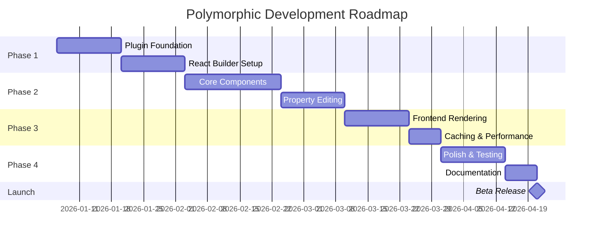

# Development Roadmap

This document outlines the phased development approach for Polymorphic with detailed milestones and timelines.

---

## Timeline Overview

---

## Phase 1: Foundation (4 weeks)

### Week 1-2: Plugin Infrastructure

**Goals:**
- Set up WordPress plugin structure
- Configure build tools
- Create admin menu and pages

**Deliverables:**

- [ ] **Plugin bootstrap** (`polymorphic.php`)
  - Plugin header with metadata
  - Autoloader setup (Composer PSR-4)
  - Activation/deactivation hooks
  - Core class initialization

- [ ] **Directory structure** as defined in architecture doc

- [ ] **Build configuration**
  - `package.json` with @wordpress/scripts
  - `tsconfig.json` for TypeScript
  - `composer.json` for PHP autoloading
  - ESLint, Prettier, PHPCS configs

- [ ] **Admin integration**
  - Admin menu registration
  - Builder page template
  - Script/style enqueuing

### Week 3-4: React Builder Foundation

**Goals:**
- Set up React application shell
- Implement basic canvas
- Create component sidebar

**Deliverables:**

- [ ] **React app entry point** (`src/index.tsx`)
  - WordPress admin integration
  - App container mounting

- [ ] **Zustand store setup**
  - Builder state (components, selection)
  - History state (undo/redo stack)
  - UI state (panels, breakpoint)

- [ ] **Basic canvas component**
  - Drop zone for components
  - Placeholder messaging

- [ ] **Component sidebar**
  - Category tabs
  - Draggable component items

---

## Phase 2: Core Functionality (5 weeks)

### Week 5-7: Component Library

**Goals:**
- Implement 6 MVP components
- Component factory pattern
- Drag-and-drop placement

**Deliverables:**

| Component | Builder Element | Properties Panel |
|-----------|-----------------|------------------|
| Section | ✓ SectionElement | ✓ SectionPanel |
| Container | ✓ ContainerElement | ✓ ContainerPanel |
| Heading | ✓ HeadingElement | ✓ HeadingPanel |
| Text | ✓ TextElement | ✓ TextPanel |
| Image | ✓ ImageElement | ✓ ImagePanel |
| Button | ✓ ButtonElement | ✓ ButtonPanel |

- [ ] **dnd-kit integration**
  - Sortable contexts
  - Drag overlays
  - Drop indicators

- [ ] **Component nesting**
  - Section → Container → Content
  - Recursive rendering
  - Depth limits

### Week 8-9: Property Editing

**Goals:**
- Property panel system
- Control components
- Real-time preview

**Deliverables:**

- [ ] **Control components**
  - TextControl
  - ColorControl
  - SpacingControl
  - LinkControl
  - MediaControl
  - SelectControl

- [ ] **Property panel**
  - Tabbed interface (Content, Style, Advanced)
  - Responsive controls
  - Default value handling

- [ ] **Save/Load system**
  - REST API integration
  - Save button with confirmation
  - Auto-save (optional)
  - Error handling

- [ ] **Undo/Redo**
  - Action history
  - Keyboard shortcuts (Cmd+Z, Cmd+Shift+Z)
  - History panel (optional)

---

## Phase 3: Frontend Rendering (3 weeks)

### Week 10-11: PHP Renderer

**Goals:**
- Component registry
- Recursive rendering
- Style generation

**Deliverables:**

- [ ] **Component base class**
  - Abstract render method
  - Props sanitization
  - Default values

- [ ] **Component implementations**
  - All 6 MVP components render correctly
  - Proper HTML output
  - Accessibility attributes

- [ ] **Style generation**
  - Inline styles from props
  - Responsive CSS via media queries
  - Custom CSS support

- [ ] **Template integration**
  - Filter `the_content`
  - Check builder enabled
  - Fallback handling

### Week 12: Caching & Performance

**Goals:**
- Transient caching
- Asset optimization
- Performance testing

**Deliverables:**

- [ ] **Transient cache**
  - Cache rendered HTML
  - Cache generated CSS
  - Invalidation on save
  - Cache key versioning

- [ ] **Asset loading**
  - Conditional script loading
  - Optional defer/async
  - Minified production builds

- [ ] **Performance benchmarks**
  - Lighthouse scores > 90
  - Load time < 500ms cached
  - Database queries < 5

---

## Phase 4: Polish & Launch (3 weeks)

### Week 13-14: Testing & Refinement

**Goals:**
- Bug fixes
- Edge case handling
- Security audit

**Deliverables:**

- [ ] **PHP unit tests**
  - Component rendering
  - Sanitization functions
  - API endpoints

- [ ] **JS integration tests**
  - Drag and drop
  - Property editing
  - Save/load flow

- [ ] **Security audit**
  - Input sanitization review
  - Output escaping check
  - Capability verification

- [ ] **Cross-browser testing**
  - Chrome, Firefox, Safari, Edge
  - Responsive testing
  - Mobile device testing

### Week 15: Documentation & Launch Prep

**Goals:**
- User documentation
- Developer docs
- Launch preparation

**Deliverables:**

- [ ] **User guide**
  - Getting started
  - Component reference
  - Tips and tricks

- [ ] **Developer documentation**
  - Hook reference
  - Custom component guide
  - API documentation

- [ ] **Launch checklist**
  - WordPress.org assets
  - Marketing materials
  - Support channels

---

## MVP Feature Scope

### Must Have (v1.0)
- 6 core components
- Drag-and-drop builder
- Property editing (content + style)
- Responsive preview
- Save/load to postmeta
- Frontend rendering
- Transient caching
- Undo/redo

### Should Have (v1.1)
- Component duplication
- Copy/paste components
- Keyboard shortcuts
- Import/export layouts
- Template library

### Could Have (v1.2)
- Global styles/theming
- Custom fonts
- Columns component
- Global blocks (reusables)
- Revision history

### Won't Have (v2.0+)
- Theme builder (headers/footers)
- WooCommerce integration
- Popup builder
- Form builder
- Dynamic data

---

## Technical Decisions

| Decision | Choice | Rationale |
|----------|--------|-----------|
| Framework | React 18 | WordPress ecosystem |
| Build Tool | @wordpress/scripts | Native WP integration |
| Drag & Drop | dnd-kit | Modern, accessible, performant |
| State | Zustand | Simple, small bundle |
| Styling | CSS Modules | Scoped, no runtime cost |
| Types | TypeScript | Better DX, safety |
| PHP Min | 8.0+ | Modern features |
| WP Min | 6.0+ | Block editor APIs |
