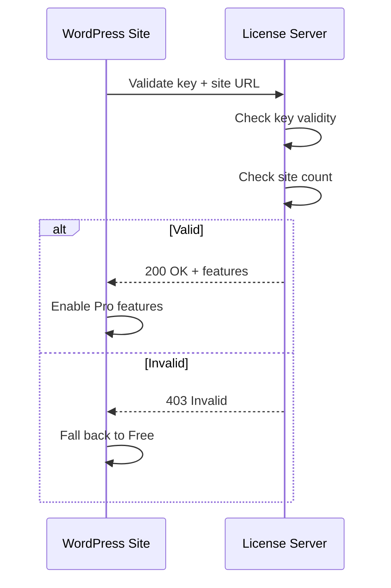

# Licensing & Pricing Strategy

This document outlines the licensing model, pricing tiers, and distribution strategy for Polymorphic.

---

## Licensing Model

### GPL v2+ Compliance

As a WordPress plugin, Polymorphic **must** be GPL-compatible:

- **Core Plugin**: GPL v2 or later (required by WordPress)
- **JavaScript/CSS**: GPL v2 or later (derivative works)
- **Documentation**: CC BY 4.0 (Creative Commons)

```php
/**
 * Plugin Name: Polymorphic
 * Plugin URI:  https://polymorphic.dev
 * Description: The lightweight, adaptable page builder for WordPress
 * Version:     1.0.0
 * Author:      Your Company
 * Author URI:  https://yourcompany.com
 * License:     GPL v2 or later
 * License URI: https://www.gnu.org/licenses/gpl-2.0.html
 * Text Domain: polymorphic
 */
```

---

## Product Tiers

### Free (Lite)

Available on WordPress.org

**Features:**
- 6 core components (Section, Container, Heading, Text, Image, Button)
- Drag-and-drop builder
- Responsive preview (3 breakpoints)
- Single postmeta storage
- Transient caching
- 3 starter templates

**Limitations:**
- No import/export
- No custom CSS per component
- No global styles
- Community support only
- "Built with Polymorphic" footer link

---

### Pro ($99/year single site)

**All Free features plus:**
- 15+ components (Columns, Video, Icon, Divider, Spacer, List, etc.)
- Import/export layouts
- Template library (50+ templates)
- Custom CSS per component
- Global styles/theming
- Priority email support
- No branding

---

### Agency ($299/year unlimited sites)

**All Pro features plus:**
- White-label (custom branding)
- Client licensing (managed updates)
- Developer API access
- Custom component SDK
- Priority support (24h response)
- Private Slack channel
- Early access to features

---

### Lifetime ($499 one-time)

**Agency tier with:**
- Lifetime updates
- Lifetime support
- Founder badge
- Input on roadmap

---

## Pricing Comparison

| Feature | Free | Pro | Agency |
|---------|------|-----|--------|
| Sites | 1 | 1 | Unlimited |
| Components | 6 | 15+ | 15+ |
| Templates | 3 | 50+ | 50+ |
| Import/Export | ❌ | ✓ | ✓ |
| Custom CSS | ❌ | ✓ | ✓ |
| Global Styles | ❌ | ✓ | ✓ |
| White-label | ❌ | ❌ | ✓ |
| Support | Community | Email | Priority |
| Price | Free | $99/yr | $299/yr |

---

## Distribution Channels

### WordPress.org (Free)
- Primary discovery channel
- SEO for "page builder" keywords
- Review social proof
- Auto-updates via WP core

### Direct Sales (Pro/Agency)
- Website: polymorphic.dev
- Payment: Stripe, PayPal
- Licensing: API key validation
- Updates: Custom update server

### Partnerships
- Hosting partners (Starter template bundles)
- Theme developers (Compatibility badges)
- Agency resellers (Volume discounts)

---

## License Key System

### Key Format
```
POLY-XXXX-XXXX-XXXX-XXXX
```

### Validation Flow



### API Endpoint

```php
POST https://api.polymorphic.dev/v1/license/validate

{
  "license_key": "POLY-XXXX-XXXX-XXXX-XXXX",
  "site_url": "https://example.com",
  "plugin_version": "1.0.0"
}

// Success Response
{
  "valid": true,
  "tier": "pro",
  "expires": "2027-01-05",
  "features": ["import_export", "custom_css", "templates"]
}

// Error Response
{
  "valid": false,
  "error": "license_expired",
  "message": "Your license has expired. Please renew."
}
```

---

## Update Delivery

### Free Updates
- Via WordPress.org plugin repository
- Standard WP update mechanism

### Pro/Agency Updates
- Custom update server
- License key required
- Changelog delivery
- Rollback capability

```php
// Custom update check
add_filter('pre_set_site_transient_update_plugins', function($transient) {
    $update = Polymorphic_Updater::check_for_updates();
    if ($update) {
        $transient->response['polymorphic/polymorphic.php'] = $update;
    }
    return $transient;
});
```

---

## Renewal & Upsell Strategy

### Renewal Reminders
- 30 days before: Email reminder
- 7 days before: Dashboard notice
- Expired: Grace period (14 days)
- After grace: Updates disabled, features work

### Upsell Triggers
- Free → Pro: "Unlock 15+ components"
- Pro → Agency: "Unlimited sites for your clients"
- Template library browse: "Get 50+ templates with Pro"
